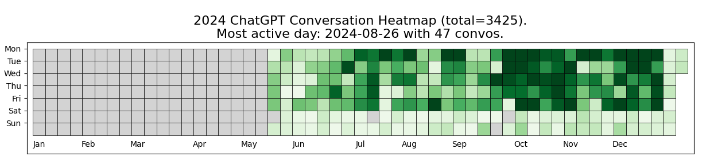

# AI Heatmap

## 📌 Overview
AI Heatmap is a simple script that generates a heatmap based on the frequency of your conversations with ChatGPT throughout the year. It helps visualize your AI interactions over time.

## 🚀 How to Use

1. **Export Your ChatGPT Conversations**  
   - Go to **Settings** → **Data Controls** → **Export** in your ChatGPT account.  
2. **Extract the Data**  
   - Unzip the exported file and place it inside a folder named `data`.  
3. **Set the Conversation Folder**  
   - Ensure `conversation_folder` points to the extracted data directory.  
4. **Adjust Your Timezone**  
   - Update `local_tz` with your local timezone to correctly timestamp each conversation.  

## ▶️ How to Run

Run the script directly with:

```python3 ./ai_heatmap.py --chatgpt_data_folder "./data/" --local_tz "Australia/Melbourne" --year "2024"```

Alternatively, edit the parameters and execute:

```./run_ai_heatmap```

## 📊 Result

After running the script, a heatmap will be **generated and displayed** showing your conversation frequency. The visualization will look similar to this:



## 📖 Reference
This project is inspired by Chip Huyen's work in the AI & Education book:  
🔗 [Original Source](https://github.com/chiphuyen/aie-book/blob/main/scripts/ai-heatmap.ipynb)

---

Feel free to modify the `README.md` as needed! 🚀😊  
This version keeps it clean, clear, and easy to follow.
